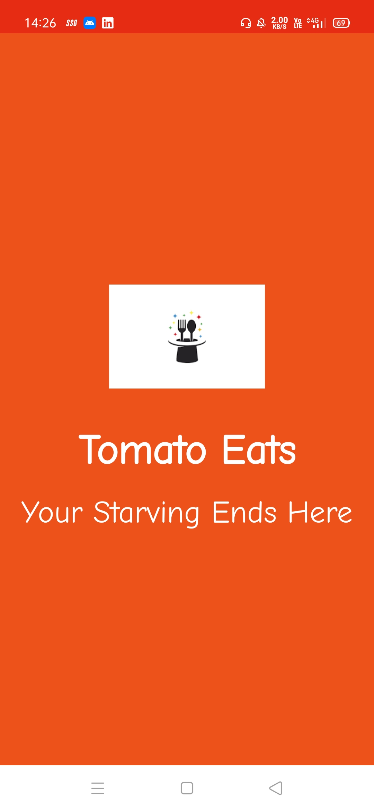
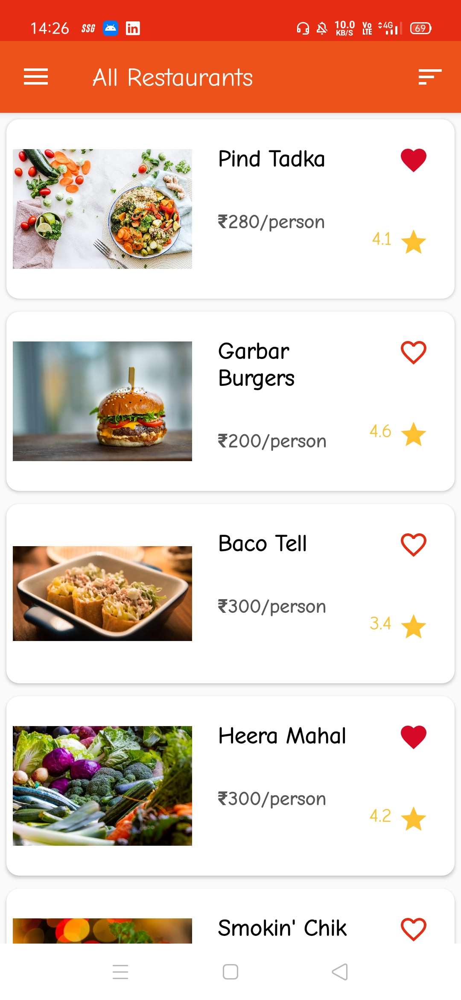
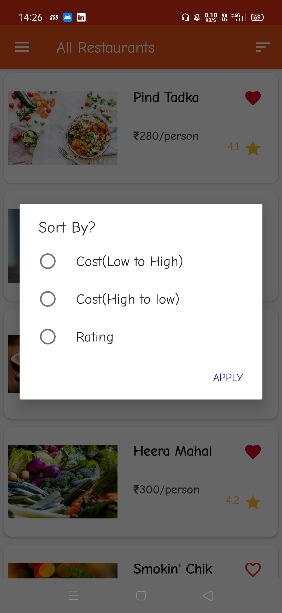
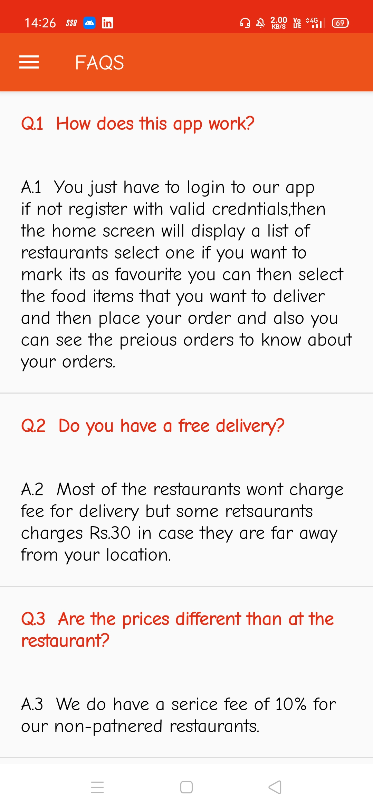
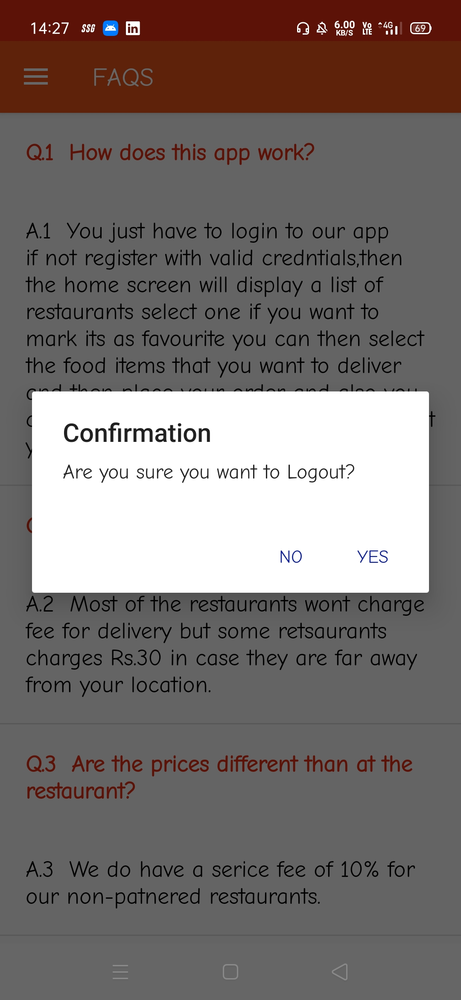
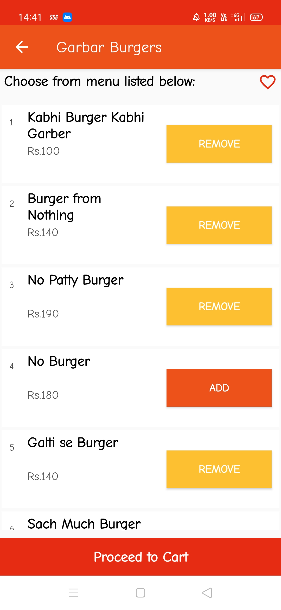
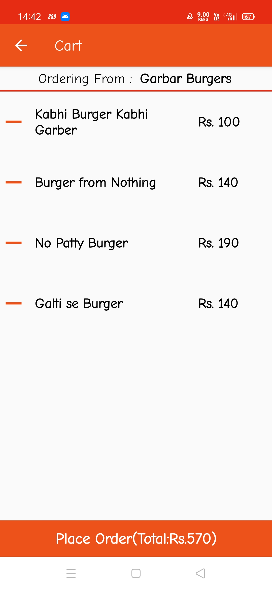
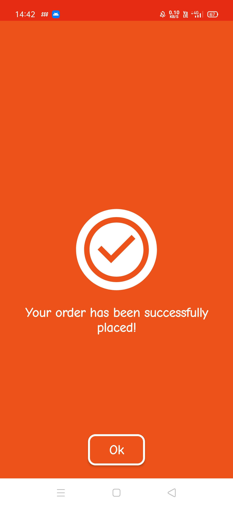

# tomatoeats
#A  simple food app using Kotlin

## screenshots 

<table>
  <tr>
    <td></td>
    <td></td>
  </tr>
<tr>
    <td></td>
    <td></td>
  </tr>
<tr>
    <td></td>
    <td></td>
  </tr>
<tr>
    <td></td>
    <td></td>
  </tr>
<tr>
    <td></td>
    <td></td>
  </tr>
   
 </table>
